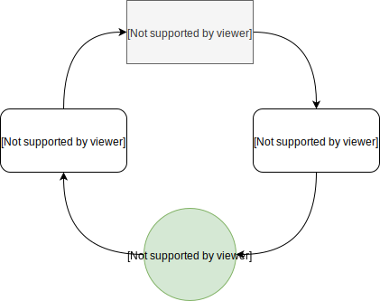

# Kaskade
[](https://travis-ci.org/gumil/Kaskade)
[](https://bintray.com/gumil/maven/kaskade/_latestVersion)
[]( https://android-arsenal.com/details/1/7421 )
[](https://codecov.io/gh/gumil/Kaskade)
[](https://www.codacy.com/app/gumil/Kaskade?utm_source=github.com&amp;utm_medium=referral&amp;utm_content=gumil/Kaskade&amp;utm_campaign=Badge_Grade)

State Container for Kotlin and Android.

The name comes from cascade, a waterfall, which reflects the objective of the library to make flows easier with unidirectional data flow.

Inspired by **MVI** or **Model View Intent**.



## Why Kaskade?
* **Lightweight** - enforces unidirectional data flow without the use of external dependencies.
* **Modular** - can be easily substituted to different implementation with or without the use of another library.
* **Extendable** - in relation to modular and lightweight, it's important to extend the API and create user defined implementation to fit specific requirements.
* **Unidirectional** - data flows in one direction.
* **Predictable** - control on `state` changes and `action` triggers.
* **DSL** - able to hide complexity in a fluent way.
* **Multiplatform** - built for JVM, iOS, and Javascript.

## Installation
1. Add to **`settings.gradle`**
```
enableFeaturePreview('GRADLE_METADATA')
```
2. Add the dependency
```
dependencies {
  // core module
  implementation 'dev.gumil.kaskade:core:0.x.y'
  // coroutines module
  implementation 'dev.gumil.kaskade:coroutines:0.x.y'
  // rx module
  implementation 'dev.gumil.kaskade:rx:0.x.y'
  // livedata module
  implementation 'dev.gumil.kaskade:livedata:0.x.y'
}
```
(Please replace x and y with the latest version numbers: [](https://bintray.com/gumil/maven/kaskade/_latestVersion) )

## Usage
Create the `Action` and `State` objects.

_Note: objects are only used here for simplicity in real projects data classes are more appropriate_

```Kotlin
internal sealed class TestState : State {
    object State1 : TestState()
    object State2 : TestState()
    object State3 : TestState()
}

internal sealed class TestAction : Action {
    object Action1 : TestAction()
    object Action2 : TestAction()
    object Action3 : TestAction()
}
```

Create `Kaskade` with `TestState.State1` as initial state
```Kotlin
val kaskade = Kaskade.create<TestAction, TestState>(TestState.State1) {
    on<TestAction.Action1> {
        TestState.State1
    }

    on<TestAction.Action2> {
        TestState.State2
    }

    on<TestAction.Action3> {
        TestState.State3
    }
}
```

Adding actions to `Action` with parameter [ActionState](kaskade/core/src/commonMain/kotlin/dev/gumil/kaskade/models.kt)
```Kotlin
on<TestAction.Action1> { actionState ->
    // do any side effects when returning a new state
    TestState.State1
}
```

Observing states
```Kotlin
kaskade.onStateChanged = {
    // Do something with new state
    render(it)
}
```

Observing states with [Emitter](kaskade/core/src/commonMain/kotlin/dev/gumil/kaskade/flow/Emitter.kt)
```Kotlin
kaskade.stateFlow.subscribe {
    // Do something with new state
    render(it)
}
```

Executing actions
```Kotlin
kaskade.process(TestAction.Action1)
```

## Documentation
Check out the [wiki](https://github.com/gumil/Kaskade/wiki) for documentation.

Some of the topics covered are:
* **[Coroutines](https://github.com/gumil/Kaskade/wiki/Coroutines)**
* **[RxJava](https://github.com/gumil/Kaskade/wiki/RxJava)**
* **[LiveData](https://github.com/gumil/Kaskade/wiki/LiveData)**
* **[Handling Process Death](https://github.com/gumil/Kaskade/wiki/Android)**

### Sample projects
* [Android App](sample/app) - Android use cases
* [Kotlin Console](sample/console) - Kotlin only project
* [Giphy Android Use Case](https://github.com/gumil/giphy) - Android master-detail flow use case
