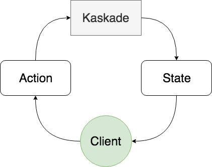

# Kaskade
[](https://jitpack.io/#gumil/Kaskade)

State Container for Kotlin and Android.

The name comes from cascade, a waterfall, which reflects the objective of the library to make flows easier with unidirectional data flow.

Inspired by **MVI** or **Model View Intent**.



# Installation

Add the JitPack repository to your build file
```
allprojects {
  repositories {
    ...
    maven { url 'https://jitpack.io' }
  }
}
```
Add the dependency
```
dependencies {
  implementation 'com.github.gumil.kaskade:kaskade:0.2.0'
}
```

# Usage
Create the `Action` and `State` objects.

_Note: objects are only used here for simplicity in real projects data classes are more appropriate_

```Kotlin
internal sealed class TestState : State {
    object State1 : TestState()
    object State2 : TestState()
    object State3 : TestState()
}

internal sealed class TestAction : Action {
    object Action1 : TestAction()
    object Action2 : TestAction()
    object Action3 : TestAction()
}
```

Create `Kaskade` with `TestState.State1` as initial state
```Kotlin
val kaskade = Kaskade.create<TestAction, TestState>(TestState.State1) {
    on<TestAction.Action1> {
        TestState.State1
    }

    on<TestAction.Action2> {
        TestState.State2
    }

    on<TestAction.Action3> {
        TestState.State3
    }
}
```

Adding actions to `Action` with parameter [ActionState](kaskade/src/main/kotlin/io/gumil/kaskade/models.kt)
```Kotlin
on<TestAction.Action1> { actionState ->
    // do any side effects when returning a new state
    TestState.State1
}
```
_Syntax is made as simple as possible with lesser ceremonies in transfroming an action to state._

Observing states
```Kotlin
kaskade.onStateChanged = {
    // Do something with new state
    render(it)
}
```

Observing states with [Flow](kaskade/src/main/kotlin/io/gumil/kaskade/flow/Flow.kt)
```Kotlin
kaskade.stateFlow.subscribe {
    // Do something with new state
    render(it)
}
```

Executing actions
```Kotlin
kaskade.process(ToastAction.Action1)
```

## Coroutines
```
dependencies {
  implementation 'com.github.gumil.kaskade:kaskade-coroutines:0.2.0'
}
```

Creating `Kaskade` with `coroutines` dsl:

Shared scope
```Kotlin
Kaskade.create<TestAction, TestState>(TestState.State1) {
    coroutines(localScope) {
        on<TestAction.Action1> {
            TestState.State1
        }
        on<TestAction.Action2> {
            TestState.State2
        }
    }
}
```

Independent scopes
```Kotlin
Kaskade.create<TestAction, TestState>(TestState.State1) {
    coroutines {
        on<TestAction.Action1>(localScope) {
            TestState.State1
        }
        on<TestAction.Action2>(newScope) {
            TestState.State2
        }
    }
}
```

## RxJava2
Add the dependency
```
dependencies {
  implementation 'com.github.gumil.kaskade:kaskade-rx:0.2.0'
}
```

Creating `Kaskade` with `rx` dsl:

Shared observer
```Kotlin
Kaskade.create<TestAction, TestState>(TestState.State1) {
    rx({ observer }) {
        on<TestAction.Action1> {
            TestState.State1
        }
        on<TestAction.Action2> {
            TestState.State2
        }
    }
}
```

Independent observers
```Kotlin
Kaskade.create<TestAction, TestState>(TestState.State1) {
    rx {
        on<TestAction.Action1>({ observer1 }) {
            TestState.State1
        }
        on<TestAction.Action2>({ observer2 }) {
            TestState.State2
        }
    }
}
```

Observing state as `Observable`
```Kotlin
kaskade.stateObservable()
```

## LiveData
Add the dependency
```
dependencies {
  implementation 'com.github.gumil.kaskade:kaskade-livedata:0.2.0'
}
```

Observing state as `LiveData`
```Kotlin
kaskade.stateLiveData()
```
